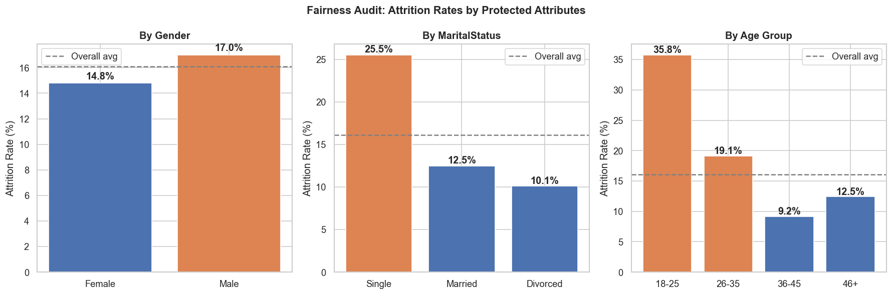

# Employee Attrition Prediction — End-to-End MLOps Pipeline

**IE University | MBD 2025 | Group 6**
Francisco Concha · Aylin Yasgul · Martin Schneider · Bader Al Eisa · Quifeng Cai

---

## Overview

Voluntary employee attrition costs organizations between 50–200% of an employee's annual salary. This project builds an end-to-end MLOps pipeline that predicts each employee's attrition risk using the IBM HR Analytics dataset (1,470 employees, 16.1% attrition rate).

The system outputs a risk score (Low / Medium / High) and probability for each employee, enabling HR teams to intervene before resignations occur.

**▶ Live demo:** [Employee Attrition Predictor](https://hr-employee-attrition-sknzxufewncsd8hvprxemb.streamlit.app/) — enter an employee's details and get a
risk tier and probability. Hosted on Streamlit Community Cloud, so it sleeps when idle; if you
see a "Zzzz" screen, click **Yes, get this app back up!** and give it a minute to wake.

The FastAPI service was previously deployed to Render on a free instance that is no longer
running. The deployment configuration (`render.yaml`, `06-cicd/Dockerfile`, GitHub Actions
workflows) is kept in the repo, and CI still builds and pushes a current image to GHCR on every
push to `main`, so the API can be redeployed without code changes.

---

## Pipeline Architecture

```
01 EDA → 02 Feature Engineering → 03 Experiment Tracking → 04 Deployment → 05 Monitoring → 06 CI/CD
```

| Stage | Folder | Description |
|-------|--------|-------------|
| 01 | `01-initial-notebook/` | Exploratory data analysis, fairness audit, naïve baseline |
| 02 | `02-feature-engineering/` | 4 engineered features, train/test split, scaling |
| 03 | `03-experiment-tracking/` | MLflow: 4 models compared, XGBoost selected |
| 04 | `04-deployment/` | FastAPI service, MLflow model loading |
| 05 | `05-monitoring/` | Prediction logging, Evidently drift report |
| 06 | `06-cicd/` | Docker, GitHub Actions CI/CD, Render deployment |

---

## Model

**Deployed algorithm:** XGBoost (`scale_pos_weight = 5.20` for the 16% attrition rate)

**Key features engineered:**
- `PromotionStagnationRatio` — years since promotion / years at company
- `WorkloadPayPressure` — overtime × monthly income
- `AverageSatisfaction` — mean of 4 satisfaction scores
- `TenureBucket` — 0–2 yrs = 0, 3–7 yrs = 1, 8+ yrs = 2

**Risk tiers:** Low (< 0.35) · Medium (0.35–0.60) · High (≥ 0.60)

### Measured results

Stage 03 compared five models plus a naïve baseline, tracked in MLflow. Ranked by
cross-validated F1 on the training set:

| Model | CV F1 | ROC-AUC | Precision | Recall |
|---|:---:|:---:|:---:|:---:|
| SVM (RBF) | **0.540** | 0.815 | 0.503 | 0.589 |
| XGBoost | 0.523 | 0.811 | 0.568 | 0.489 |
| Logistic Regression | 0.497 | **0.831** | 0.376 | **0.742** |
| Logistic Regression (4 features) | 0.410 | 0.735 | 0.296 | 0.668 |
| Random Forest | 0.387 | 0.805 | 0.737 | 0.268 |
| Naïve baseline (always "stays") | 0.000 | 0.500 | 0.000 | 0.000 |

Held-out test set (294 employees, 47 leavers):

| Model | F1 | ROC-AUC | Precision | Recall |
|---|:---:|:---:|:---:|:---:|
| SVM (RBF) — Stage 03 selection | 0.505 | 0.796 | 0.450 | 0.574 |
| XGBoost — deployed in Stages 04–06 | 0.391 | 0.757 | 0.425 | 0.362 |

**Honest read on this.** XGBoost was carried into deployment for engineering reasons — fast
retraining in CI, native probability outputs, and a simple serialisation path — but on the
held-out test set it is the weaker model. Recall of 0.36 means the deployed service misses
roughly two thirds of employees who actually leave, which is the wrong error to make for a
retention use case. Neither model reaches the project's own targets (F1 ≥ 0.75, ROC-AUC ≥ 0.80).
This is a genuine limitation of the work, not a presentation choice — see
[Limitations](#limitations).

---

## Quick Start

### Prerequisites
```bash
python -m venv .venv
source .venv/bin/activate
pip install -r 06-cicd/requirements.txt
```

### Run locally
```bash
cd 06-cicd
python train.py       # train model, save to models/
python app.py         # start API on port 9696
```

### Test the API
```bash
pytest -q 06-cicd/test_api.py
```

### API endpoints
| Endpoint | Method | Description |
|----------|--------|-------------|
| `/` | GET | Welcome message |
| `/health` | GET | Service status |
| `/predict` | POST | Predict attrition risk |
| `/docs` | GET | Swagger UI |

---

## Streamlit App

An interactive web UI (`streamlit_app.py`) lets HR users score a single employee
from a form and see the risk tier and probability. The app is **self-contained**:
it trains the XGBoost model at startup from the committed processed data and
reuses the committed `StandardScaler`, so no separate model artifact or API is
required.

### Run locally
```bash
pip install -r requirements.txt
streamlit run streamlit_app.py
```

The app is hosted on Streamlit Community Cloud at
[https://hr-employee-attrition-sknzxufewncsd8hvprxemb.streamlit.app/](https://hr-employee-attrition-sknzxufewncsd8hvprxemb.streamlit.app/). It sleeps after a period of inactivity and wakes on the first visit.

---

## CI/CD Pipeline

Every push to `main` automatically:
1. Trains the model
2. Lints the code (flake8)
3. Builds a Docker image
4. Runs API tests inside the container
5. Pushes the image to GitHub Container Registry
6. Render pulls the new image and redeploys

**Workflows:** `.github/workflows/ci-cd.yml` · `.github/workflows/train.yml`

---

## Repository Structure

```
.
├── .github/workflows/     # CI/CD workflows
├── 01-initial-notebook/   # EDA
├── 02-feature-engineering/# Feature pipeline
├── 03-experiment-tracking/# MLflow experiments
├── 04-deployment/         # FastAPI + MLflow
├── 05-monitoring/         # Evidently drift monitoring
├── 06-cicd/               # Docker + CI/CD + Render
├── data/
│   └── processed/         # train.csv, test.csv, scaler
├── plots/                 # EDA visualizations
├── streamlit_app.py       # Streamlit web UI (Streamlit Cloud entry point)
├── requirements.txt       # Dependencies for the Streamlit app
├── render.yaml            # Render deployment manifest
└── README.md
```

---

## Dataset

IBM HR Analytics Employee Attrition dataset — 1,470 employees, 35 features, binary target (Attrition Yes/No).

---

## Key Findings

From the exploratory analysis (`01-initial-notebook/attrition_eda.ipynb`):

| # | Finding | Why it matters |
|---|---|---|
| 1 | **16.1% attrition rate** — heavily imbalanced | Accuracy is misleading; F1 and recall are the metrics that matter |
| 2 | **Naïve "everyone stays" baseline: 83.9% accuracy, F1 = 0.00** | Sets the floor — a high-accuracy model can be worthless here |
| 3 | **Overtime: 30.5% attrition vs 10.4% without** | The strongest single predictor in the dataset |
| 4 | **New hires (0–2 years) leave at ~3× the rate of long-tenured staff** | Justifies the `TenureBucket` feature; points retention effort at onboarding |
| 5 | **Leavers earn $4,787/month on average vs $6,833 for stayers** | Motivates the `WorkloadPayPressure` feature |
| 6 | **All four satisfaction scores are inversely correlated with attrition** | Justifies the `AverageSatisfaction` composite |
| 7 | **Attrition concentrates in sales roles**, especially Sales Representatives | Retention spend should be targeted, not uniform |

### Fairness audit

Group-level attrition rates were audited on protected attributes before any modelling, since
this is an employment-decision use case:

| Attribute | Finding |
|---|---|
| **Age** | Employees aged 18–25 leave at **35.8%** — by far the highest group |
| **Marital status** | Single employees leave at **25.5%**, more than double married or divorced staff |
| **Gender** | Minimal difference (men 17.0%, women 14.8%) |

These are disparities in the *raw data*, not model outputs, but they mean any deployed model
will inherit them. Age and marital status are protected attributes in most employment
jurisdictions.



---

## Business Recommendations

1. **Target overtime, not headcount.** Overtime is the strongest predictor in the data.
   Reducing sustained overtime in the affected teams is a more direct lever than
   compensation adjustments.
2. **Focus retention on the first two years.** New hires leave at roughly three times the
   rate of long-tenured employees; onboarding and early-tenure support have the highest
   expected return.
3. **Concentrate effort on sales roles**, where attrition is most concentrated, rather than
   spreading retention budget evenly.
4. **Do not use this model for individual employment decisions.** Given the fairness findings
   and the deployed model's recall of 0.36, it is suitable as a cohort-level prioritisation
   signal for HR outreach, not as a basis for decisions about specific people.

---

## Limitations

- **The deployed model underperforms.** Test F1 of 0.391 and recall of 0.362 fall short of the
  project's targets (F1 ≥ 0.75, ROC-AUC ≥ 0.80). It misses most actual leavers.
- **The strongest models were not the deployed one.** SVM scored higher on the test set, and
  plain logistic regression had both the best ROC-AUC (0.831) and by far the best recall (0.742).
  A recall-first use case arguably calls for the logistic model.
- **Small dataset.** 1,470 employees with only 47 leavers in the test set, so test metrics carry
  wide confidence intervals.
- **The data is IBM's synthetic HR dataset**, not real organisational data. Relationships in it
  may not transfer to a real workforce.
- **Fairness was audited but not mitigated.** No reweighting or constraint was applied.
- **No temporal validation.** The split is random, not time-based, so the evaluation does not
  reflect predicting future resignations from past data.

---

## Future Improvements

- Deploy the logistic regression model, or calibrate and threshold-tune XGBoost for recall,
  and re-evaluate against the F1/recall targets
- Add a time-based train/test split to reflect the real prediction task
- Apply fairness mitigation (reweighting or constrained optimisation) on age and marital status
- Add SHAP explanations to the API response so HR sees *why* an employee is flagged

---

## Team

This was a five-person group project for the MLOps course (Group 6): Francisco Concha,
Aylin Yasgul, Martin Schneider, Bader Al Eisa and Quifeng Cai.
